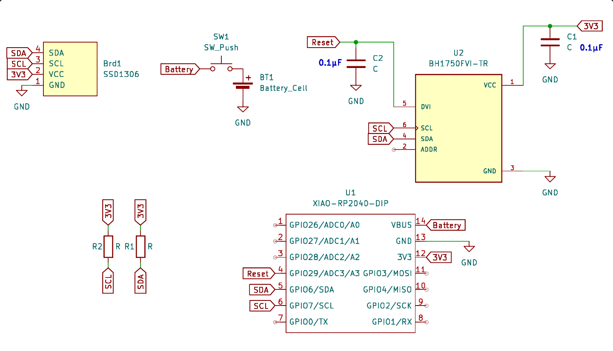
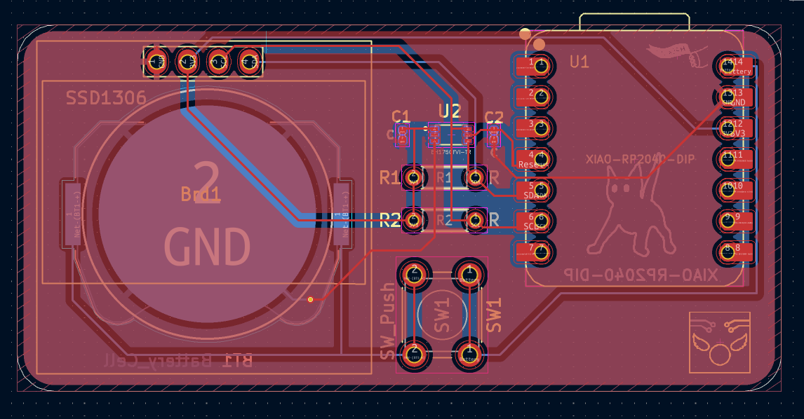
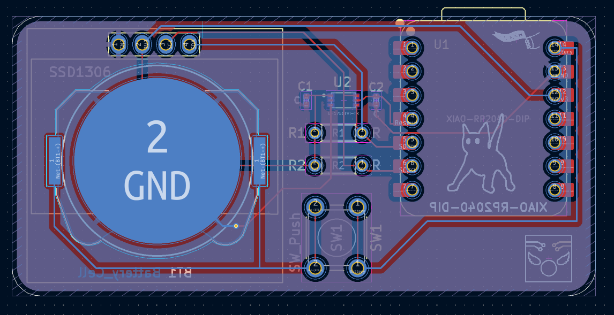
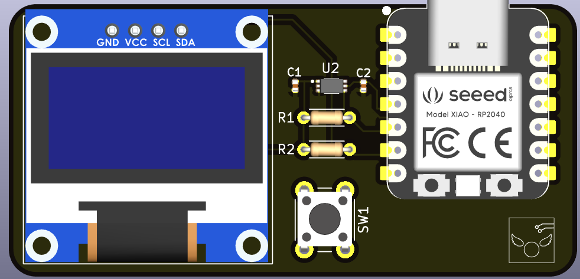
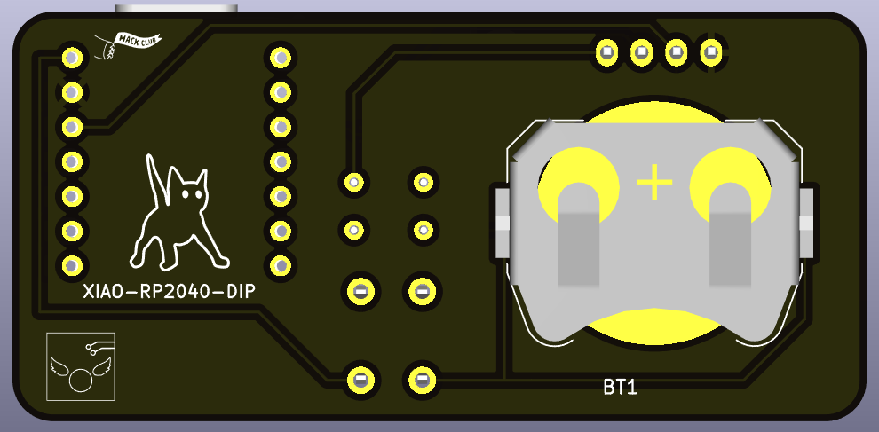

> ⚠️ **WARNING**  
> This project has **not been tested on real hardware yet**.  
> The PCB has been designed, and the firmware is complete, but it hasn't been uploaded or verified on a physical board yet.  

# LuminanceMeter
A simple hardware project that features an Ambient Light Sensor and 0.96" OLED screen controlled by a XIAO-RP2040 microcontroller to measure light level and display it interms of lux (luminance).

## Features

- **Uses Sensor to read luminance**
- **OLED Display (128x64):** displays ambient light level in lux.  
- **Portable:** With a CR2032 battery holder you can take it anywhere after flashing it with the firmware . (You hold the button to measure luminance if you are using battery to power it.)
---
## Screenshots

### Schematic

### PCB

### 3D Front View

### 3D Back View

---

## Firmware

The firmware has been written with Arduino IDE using C++.

**Libraries used:**
- `Wire.h`: I2C communication
- `Adafruit_GFX.h`: OLED graphics
- `Adafruit_SSD1306.h`: OLED driver

---

## PCB Design

The PCB is designed using KiCad.
- All symbols are from KiCad or open-source, you can find the custom ones in the "Resources" folder.
---

## Acknowledgement
Made for [Hermes](https://hermes.hackclub.com/).
Thanks to [Meghana Madiraju](https://github.com/MeghanaM4) for hosting this event and for the support.

## License

#### [MIT License](LICENSE.txt).  
---

## Author
[GlassyBridge](https://github.com/GlassyBridge)
